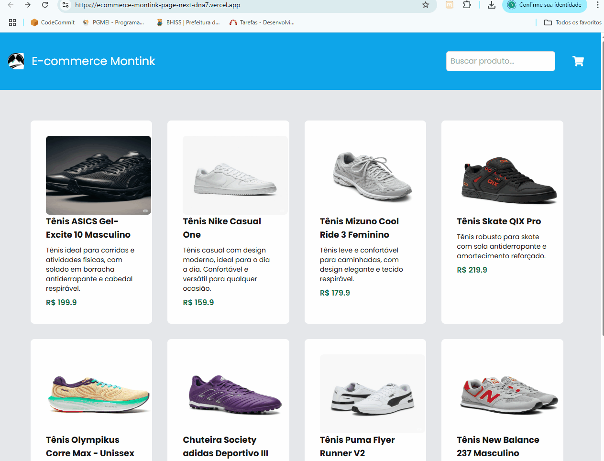

# 🛍️ Ecommerce Montink Page - Next.js

Este projeto é uma aplicação de e-commerce voltada para a venda de **calçados (tênis)**, desenvolvida com **Next.js 15** e **TypeScript**. Ele simula a navegação em uma loja online com foco na experiência do usuário e boas práticas modernas de frontend.


🔗 **Acesse a versão online do projeto:**  
[](https://ecommerce-montink-page-next-dna7.vercel.app/)

---

## 🎥 Demonstração



---

## 📄 Funcionalidades principais

- ✅ **Página inicial com lista de produtos**  
  A página inicial exibe um catálogo de produtos em forma de **cards** clicáveis. Cada card representa um tênis com imagem e nome, e ao clicar, o usuário é redirecionado para uma **página de detalhes do produto**.

- ✅ **Página de detalhes do produto**  
  Ao acessar a página de um produto específico, os seguintes requisitos são atendidos:

  - 🖼️ **Imagem principal do produto**
  - 🔍 **Miniaturas abaixo da imagem principal**: Ao clicar nas miniaturas, a imagem principal é atualizada dinamicamente.
  - 📝 **Título, descrição e preço do produto**
  - 🎯 **Seletores dinâmicos de tamanho e cor**: Os tamanhos e cores são carregados dinamicamente com base nos dados do produto.
  - 📍 **Campo de CEP**: Campo formatado automaticamente (ex: `12345-678`) e com validação.
  - 🔎 **Validação de CEP via API ViaCEP**: Verifica se o CEP existe e exibe o endereço completo ao usuário (logradouro, bairro, cidade e UF).
  - 💾 **Persistência de dados no localStorage**:
    - Informações selecionadas (imagem, tamanho, CEP e endereço) são salvas no `localStorage`.
    - Os dados persistem mesmo após atualização da página por até **15 minutos**, garantindo melhor experiência ao usuário.

---

## 🚀 Tecnologias utilizadas

- [Next.js 15](https://nextjs.org/)
- [TypeScript](https://www.typescriptlang.org/)
- [Tailwind CSS](https://tailwindcss.com/)
- [ViaCEP API](https://viacep.com.br)

---

## 📦 Instalação local

```bash
git clone https://github.com/diogodlemos/ecommerce-montink-page-next.git
cd ecommerce-montink-page-next
npm install
npm run dev
